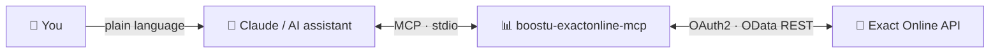

# 📊 BoostU Exact Online MCP

### The open-source Exact Online MCP server. Ask your bookkeeping questions in plain language, from Claude and other AI assistants. 🤖

[](https://github.com/boostuagency/boostu-exactonline-mcp/actions/workflows/ci.yml)
[](https://www.npmjs.com/package/boostu-exactonline-mcp)
[](https://www.npmjs.com/package/boostu-exactonline-mcp)
[](https://nodejs.org)
[](https://modelcontextprotocol.io)
[](https://www.npmjs.com/package/boostu-exactonline-mcp)
[](LICENSE)
[](https://boostu.be)

---

## 💡 What is this?

`boostu-exactonline-mcp` is a [Model Context Protocol](https://modelcontextprotocol.io) server
that exposes the Exact Online REST API to AI assistants — Claude Desktop, Claude Code, Cursor
and Windsurf among them. It ships 147 tools covering the core of a small business's
administration: relations, quotations, sales and purchase invoices, the general ledger,
banking, VAT, the item catalogue, documents, and the pre-aggregated financial reports.

Point your assistant at it and ask *"who still owes me money and for how long?"* instead of
building a report.

> ### Prefer not to self-host?
> BoostU offers a managed, always-on edition for small and medium businesses at
> **[exactonline-mcp.boostu.be](https://exactonline-mcp.boostu.be)** — no OAuth setup, no
> token rotation to worry about, and a one-click connector for Claude.
>
> This repository is the open-source MCP server itself: run it locally against your own Exact
> App Center app. The hosted edition adds multi-tenant authentication, a dashboard, usage
> insights and managed token handling on top of the same server.

| | Self-host (this repo) | Managed ([boostu.be](https://exactonline-mcp.boostu.be)) |
|---|---|---|
| **Price** | Free, MIT-licensed | Free preview, then paid |
| **Setup** | Register your own Exact app, run via `npx` | Copy one connector URL into Claude |
| **Tokens** | You manage `.env` and the rotating refresh token | Encrypted and rotated for you |
| **Best for** | Developers and self-hosters | Non-technical teams and their accountants |

---

## 🔌 How it works



You ask in plain language. Claude calls this MCP server, which authenticates to Exact Online
over OAuth2 and runs the matching OData request against your division. Your data stays in
Exact; this server only brokers the calls.

> Use the outline button at the top-right of this file to jump to any section.

---

## ✨ Highlights

- 💶 **Cash-flow answers out of the box**: aging receivables and payables, outstanding invoice
  totals, and a convenience `exact_overdue_receivables` report that sums what is past due
- 📒 **The full ledger**: chart of accounts, journals, financial periods, every transaction
  line, the trial balance, and manual journal entries
- 🧾 **Sales and purchasing end to end**: quotations (accept and reject included), sales
  orders, sales invoices (book, print and email in one call), and supplier invoices
- 🏦 **Banking**: statements and their lines, cash books, payment terms, SEPA mandates and
  queued payments
- 🌍 **Every Exact region**: Belgium, the Netherlands, Germany, France, the UK, Spain and the
  international environment
- 🏢 **Multi-division**: an accountant's login can serve several companies from one
  connection; every tool takes a `division` argument
- 🔐 **OAuth2 with rotation handled properly**: Exact invalidates each refresh token the
  moment it is exchanged, so rotations are persisted to disk and concurrent refreshes are
  collapsed into one request
- 🛡️ **Read-only mode**: `EXACT_READ_ONLY=true` and no write tool is even registered
- 🧩 **Selectable tool groups**: load only what you need via `EXACT_TOOLS` to keep your
  assistant's context lean
- 🚪 **An escape hatch**: `exact_request` reaches any Exact resource that has no dedicated
  tool yet, so payroll, manufacturing and projects are never out of reach

---

## 🚀 Quick Start

### Run without installing

```bash
npx boostu-exactonline-mcp
```

### Global install

```bash
npm i -g boostu-exactonline-mcp
boostu-exactonline-mcp
```

### Claude Desktop

Add to `~/Library/Application Support/Claude/claude_desktop_config.json` (macOS) or
`%APPDATA%\Claude\claude_desktop_config.json` (Windows):

```json
{
  "mcpServers": {
    "exactonline": {
      "command": "npx",
      "args": ["-y", "boostu-exactonline-mcp"],
      "env": {
        "EXACT_CLIENT_ID": "your-client-id",
        "EXACT_CLIENT_SECRET": "your-client-secret",
        "EXACT_REFRESH_TOKEN": "your-refresh-token",
        "EXACT_REGION": "be",
        "EXACT_TOKEN_STORE": "/absolute/path/to/.exact-token"
      }
    }
  }
}
```

### Claude Code

Add to your project's `.mcp.json` or `~/.claude/mcp.json`:

```json
{
  "mcpServers": {
    "exactonline": {
      "command": "npx",
      "args": ["-y", "boostu-exactonline-mcp"],
      "env": {
        "EXACT_CLIENT_ID": "your-client-id",
        "EXACT_CLIENT_SECRET": "your-client-secret",
        "EXACT_REFRESH_TOKEN": "your-refresh-token",
        "EXACT_REGION": "be",
        "EXACT_TOKEN_STORE": "/absolute/path/to/.exact-token"
      }
    }
  }
}
```

### Cursor

Add to `.cursor/mcp.json` in your project root (or the global `~/.cursor/mcp.json`), using the
same block as above.

### Windsurf

Add the same block to `~/.codeium/windsurf/mcp_config.json`.

> **Set `EXACT_TOKEN_STORE` to an absolute path.** Exact rotates the refresh token on every
> refresh and invalidates the previous one immediately. Without a store, restarting the client
> leaves you re-authorizing by hand.

---

## 🔑 Authentication

You need three values from an app you register in the Exact App Center, plus your region.
[docs/AUTHENTICATION.md](docs/AUTHENTICATION.md) walks through it step by step, including the
two things that catch people out: the redirect URI must match character for character, and the
authorization code comes back URL-encoded.

The short version:

```bash
git clone https://github.com/boostuagency/boostu-exactonline-mcp.git
cd boostu-exactonline-mcp
npm install
cp .env.example .env          # fill in EXACT_CLIENT_ID, EXACT_CLIENT_SECRET, EXACT_REGION
node get-refresh-token.mjs    # opens the OAuth flow, writes EXACT_REFRESH_TOKEN to .env
node validate.mjs             # verifies the credentials and lists your divisions
npm run build && node test-mcp.mjs
```

---

## ⚙️ Configuration

| Variable | Required | Default | What it does |
|----------|----------|---------|--------------|
| `EXACT_CLIENT_ID` | yes | — | Client ID of your Exact App Center app |
| `EXACT_CLIENT_SECRET` | yes | — | Client Secret of that app |
| `EXACT_REFRESH_TOKEN` | yes | — | Seed refresh token from the one-time authorization |
| `EXACT_REGION` | no | `be` | `be`, `nl`, `de`, `fr`, `uk`, `es`, `com`, or a full base URL |
| `EXACT_TOKEN_STORE` | no | — | File the rotated refresh token is persisted to. Strongly recommended. |
| `EXACT_DIVISION` | no | current | Pin every call to one administration |
| `EXACT_READ_ONLY` | no | `false` | `true` registers read tools only |
| `EXACT_TOOLS` | no | all | Comma-separated group keys to load |

The server starts and answers MCP introspection without credentials, so a client can discover
the tools before you finish the OAuth setup. Tool calls fail with a clear auth error until the
variables are set.

---

## 🧰 Tool groups

147 tools across ten groups. Load a subset with `EXACT_TOOLS` to keep your assistant's context
manageable.

| Group | Tools | What it covers |
|-------|-------|----------------|
| `system` | 9 | Who am I, which divisions, licensed features, rate-limit status, the generic request and delete escape hatches |
| `relations` | 13 | Customers, suppliers, prospects, their contacts, addresses and bank accounts |
| `sales` | 28 | Quotations and their lines, sales orders, sales invoices, booked sales entries, goods deliveries |
| `purchase` | 19 | Supplier invoices as ledger entries, the purchase-invoice workflow, purchase orders, goods receipts |
| `financial` | 19 | Chart of accounts, journals, periods, transaction lines, trial balance, manual journal entries, currencies |
| `reports` | 11 | Receivables, payables, aging, outstanding totals, profit and loss, revenue, journal status, VAT returns |
| `banking` | 16 | Bank and cash statements and their lines, banks, payment terms, payments, SEPA mandates |
| `items` | 18 | Items, item groups, sales prices, price lists, units, customer item codes |
| `vat` | 5 | VAT codes, their rate history, deductibility percentages |
| `documents` | 9 | Documents, attachments (upload included), categories, types, folders |

Useful profiles:

```bash
EXACT_TOOLS=system,reports                      # cash-flow watching, 20 tools
EXACT_TOOLS=system,relations,sales,items,vat    # sales desk, 73 tools
EXACT_TOOLS=system,financial,banking,reports    # bookkeeping, 55 tools
```

Full resource manifest: [docs/exact-endpoints.md](docs/exact-endpoints.md).
Non-technical walkthrough in Dutch: [docs/KMO-GIDS.md](docs/KMO-GIDS.md).

---

## 🎨 Tool design

Exact exposes a few hundred near-identical OData collections. Generating five tools for each
would produce a surface no assistant can hold in context, so two reductions are baked in:

- **Reading one record is the list tool with an `id`**, not a separate `_get` tool.
- **Deleting is one generic `exact_record_delete`**, not one per collection. It carries the
  warning that accounting records often cannot be removed once processed.

Everything else follows one shape. A list tool takes `filter`, `select`, `top`, `orderby`,
`expand`, `skiptoken` and `count`, mapping straight onto Exact's `$`-parameters, and every
resource declares a sensible default `select` so responses stay small.

---

## 💬 Example prompts

> "Which customer invoices are overdue, oldest first, and what is the total?"

> "Show the trial balance for periods 1 to 6 of 2026, profit-and-loss accounts only."

> "Find the relation with VAT number BE0123456789 and list their last five invoices."

> "Create a draft sales invoice for Acme BV with two lines of consultancy at 950 euro, then
> show it to me before booking."

> "Which supplier invoices fall due in the next fourteen days?"

> "What did we spend on account 613000 this quarter, per month?"

---

## 📈 Rate limits

Exact enforces two windows per app-and-company combination: one per minute and one per day.
Exceeding either returns HTTP 429. This server reads the `X-RateLimit-*` headers on every
response, and a 429 error message names how much budget is left and when it resets.
`exact_rate_limit_status` reports the latest counters on demand.

Pass `select` and `filter` rather than fetching whole collections: it is the difference
between one call and forty.

---

## 🧪 Development

```bash
npm install
npm run dev        # run from source with tsx
npm run typecheck  # tsc --noEmit
npm test           # vitest
npm run build      # emit dist/
```

Tests cover the OAuth rotation and concurrency guard, the OData literal and query helpers,
the client's envelope handling, paging and error shaping, region resolution, and the tool
registration surface including read-only mode.

---

## 🤝 Contributing

Pull requests are welcome. See [CONTRIBUTING.md](CONTRIBUTING.md) for the workflow and the
conventions this codebase follows. Adding a resource is usually a few lines of data in the
matching `src/tools/*.ts` file.

---

## 🔒 Security

Never commit `.env` or your token store. See [SECURITY.md](SECURITY.md) for how to report a
vulnerability.

---

## 📄 License

MIT — see [LICENSE](LICENSE).

Not affiliated with, endorsed by, or sponsored by Exact Group B.V. "Exact" and "Exact Online"
are trademarks of Exact Group B.V.

Built by [BoostU](https://boostu.be).
